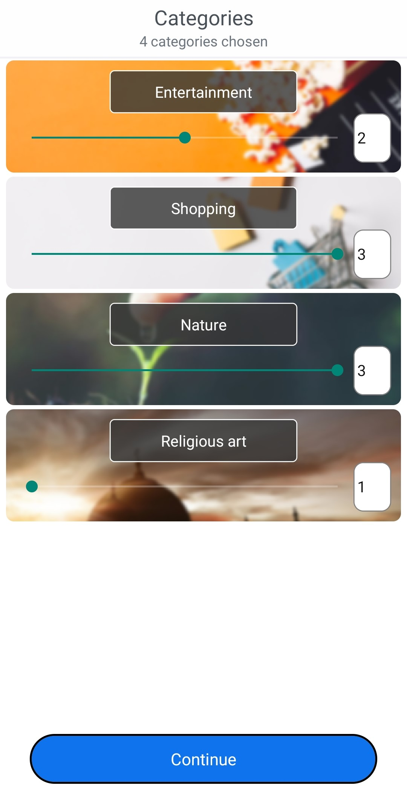

# Travel Guider

This is a mobile application for finding
places worth visiting in Kosova where users can
sign up and choose different categories and their
interest in those categories. Then based on the
user preferences, different number of places are
shown in the feed of the app, where user can
check the description of the place, reviews of
people who visited it, the location of it, and also
the user can review it. 

The app is developed using React Native on the front-end, so the code is cross-platform (iOS and Android) and Firebase for storing the data of the users, places, categories..
The execution of the app is made on android device. The screenshots below show how the app works basically. Even though the app is functional for basic use, it still needs testing and more optimization to increase the performance, and why not implementing new modules that make the app much more useful for the user.

  

  

  

